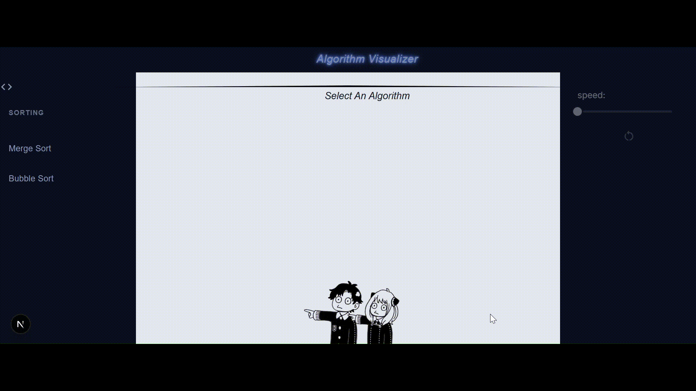
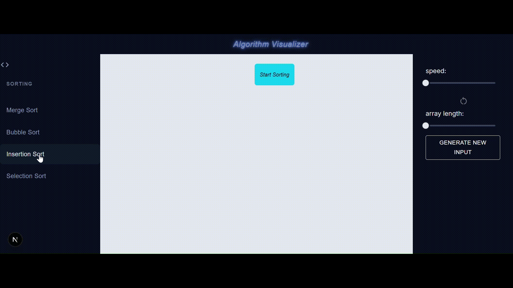
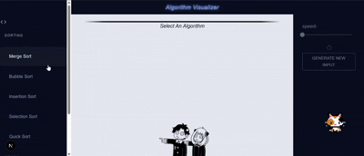

# Algorithm Visualizer

An interactive algorithm visualizer built with **Next.js** and **React**, designed to make algorithms feel less abstract and more intuitive.  
Best Viewed on Large Screens like tablet, laptop and desktop.
Instead of staring at dry pseudocode, this project shows step-by-step animations that reveal how algorithms actually work internally.

This is **v2.5** of the project.

The focus right now is on building a solid, reusable visualization and animation architecture. New algorithms will be added **incrementally** to the repository.

---

## Current Version (v2.5)

### Implemented Algorithms
Sorting
  - **Merge Sort**
  - **Bubble Sort**
  - **Insertion Sort**
  - **Selection Sort**
  - **Quick Sort**
Graph
  - **BFS**

Each algorithm:
- Generates its own step sequence
- Plays through a shared animation engine
- Uses color-coded actions to indicate comparisons, swaps, overwrites, completion, etc.

More algorithms will be added progressively.

---

## Demo

Present Algorithms: Merge Sort, and Bubble Sort.

New Added: Insertion Sort, and Selection Sort.

 
Started Graph Algorithm Visualization With BFS

<i>Speed in above demo is ~2 times faster so as to shorten the demo.</i>
---

## Features

- Sidebar with categorized algorithm list
- Dynamic visualization area that loads the selected algorithm
- General control panel:
  - Speed control
  - Generate new input (along with input controls)
  - Replay functionality
- Algorithm-specific controls that appear dynamically
- Step-based animation system.
- Color legend to explain actions during visualization
- Clean, minimal, dark-themed UI

---

## Architecture Overview

- Algorithms are **logic-only** (no UI code)
- Each algorithm outputs a standardized list of actions (`steps`)
- A shared animator consumes these steps to drive animations
- Visualization components are reusable and algorithm-agnostic

This keeps the codebase scalable and makes adding new algorithms straightforward.

---

## Tech Stack

- **Next.js**
- **React**
- **TypeScript**
- **Material UI**
- **CSS**

---

## Status

Actively under development.  
This project will evolve incrementally with new algorithms and features added over time.
